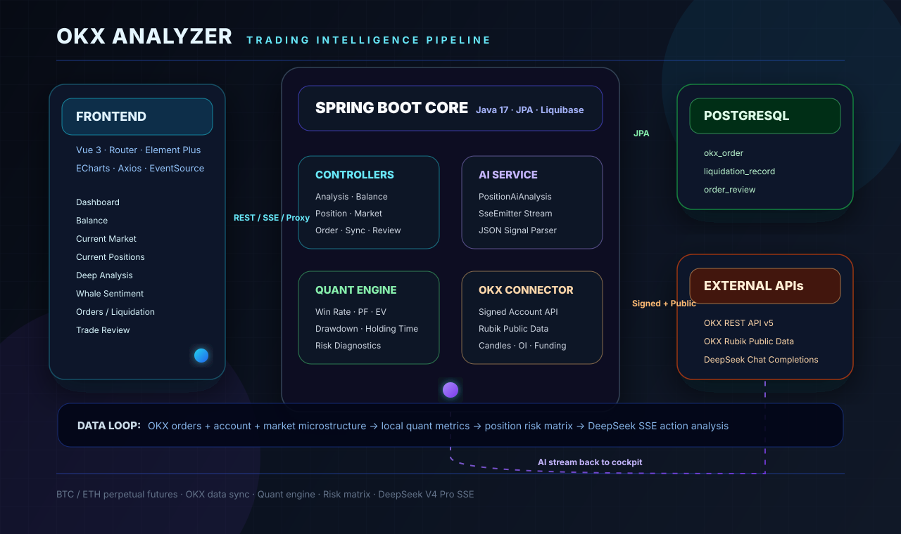

<div align="center">

# ✨ OKX Analyzer

### 📊 A machine-grade trading cockpit for BTC / ETH perpetual futures

**⚡ OKX 合约交易数据同步 · 📈 资金曲线 · 🧠 深度量化 · 🐋 主力大户 · 🎯 当前行情 · 🛡️ 当前持仓 · 🤖 DeepSeek V4 Pro 流式仓位解析**

[](https://openjdk.org/)
[](https://spring.io/projects/spring-boot)
[](https://vuejs.org/)
[](https://www.postgresql.org/)
[](https://echarts.apache.org/)
[](https://api-docs.deepseek.com/)

```text
┌──────────────────────────────────────────────────────────────────────────────┐
│  ✨ OKX ANALYZER / MACHINE TRADING INTELLIGENCE CONSOLE                      │
├──────────────────────────────────────────────────────────────────────────────┤
│  📡 Market Feed -> Order Sync -> Quant Engine -> Risk Matrix -> AI Core      │
│  🪙 BTC / ETH   -> PostgreSQL -> Spring Boot  -> ECharts    -> SSE          │
└──────────────────────────────────────────────────────────────────────────────┘
```

[🚀 核心能力](#核心能力) · [🧩 系统架构](#系统架构) · [⚙️ 快速启动](#快速启动) · [🤖 DeepSeek-SSE](#deepseek-v4-pro-流式解析) · [🔌 接口矩阵](#接口矩阵) · [🛡️ 工程标准](#工程标准)

</div>

---

## 🎯 项目定位

`OKX Analyzer` 是一个面向 **BTC / ETH 永续合约交易者** 的本地化交易分析终端。它不是简单的订单列表，而是把 OKX 历史订单、账户资金、强平记录、行情数据、主力大户指标、当前持仓和交易复盘统一接入，再通过 Vue + ECharts 做成可持续观察的交易驾驶舱。

项目的核心目标是回答几个交易中最关键的问题：

| ❓ 问题 | 🧠 系统如何回答 |
|---|---|
| 我到底赚在哪里、亏在哪里？ | 胜率、盈亏比、期望值、最大回撤、滚动胜率、日历盈亏、月度统计 |
| 我是不是总在扛单？ | 赢单/输单平均持仓、亏损持仓时长、补仓占比、背离占比、止损纪律诊断 |
| 当前仓位是否危险？ | 持仓多久、浮盈亏、补仓次数、爆仓距离、方向是否顺势、是否和市场背离 |
| 主力和散户是否分歧？ | 大户持仓多空比、账户多空比、主动买卖量、资金费率、OI 增速 |
| BTC 和 ETH 当前该怎么看？ | 当前行情页提供趋势、RSI、MACD、EMA、成交量、相对强弱与关键价位 |
| 当前是否该减仓、持有、观望？ | DeepSeek V4 Pro 接收完整上下文后通过 SSE 输出仓位解析、行情解析和动作建议 |

> 所有分析均用于交易复盘、风险识别和决策辅助，不构成投资建议。

---

<a id="核心能力"></a>

## 🚀 核心能力

### 📊 1. 总览仪表盘

总览页提供交易系统的全局状态，适合每天开盘前或复盘后快速扫描。

| 模块 | 说明 |
|---|---|
| 核心指标卡 | 总交易数、胜率、净盈亏、Profit Factor、最大回撤等 |
| 累计盈亏曲线 | 观察账户收益趋势和回撤阶段 |
| 当前账户资金 | 展示交易账户、资金账户与总权益 |
| 每日盈亏 | 区分盈利日、亏损日和波动集中区 |
| 滚动 20 单胜率 | 用最近 20 单窗口观察策略状态是否衰退 |
| 主力行为雷达 | 用多维指标快速判断市场结构 |
| 多空胜率对比 | 做多和做空方向的胜率差异 |
| 专业收益日历 | 用日历热力图定位高风险交易日期 |

### 💰 2. 资金变化

资金页独立展示账户金额变化，不和订单分析混在一起。

| 图表 | 价值 |
|---|---|
| 总资金曲线 | 观察账户权益长期变化 |
| 每日资金变化 | 定位资金突增、突减和回撤区 |
| 账户结构 | 区分交易账户和资金账户 |
| 收益日历 | 用日历视角发现连续亏损或盈利周期 |
| 月度资金变化 | 衡量月度资金质量和稳定性 |

### 📡 3. 当前行情

当前行情页聚焦 BTC / ETH，适合只交易这两个品种的工作流。

| 能力 | 说明 |
|---|---|
| BTC / ETH 切换 | 只保留核心交易品种，避免无意义品种噪音 |
| 价格结构 | K 线、趋势、均线结构和关键区间 |
| 趋势评分 | 多维指标综合评分 |
| RSI / MACD | 动量状态、背离风险和趋势延续判断 |
| 成交量与均量 | 判断突破是否有量能确认 |
| BTC / ETH 相对强弱 | 判断当前资金更偏向 BTC 还是 ETH |
| 关键价位与结论 | 输出支撑、压力、风险点和方向判断 |

### 🧠 4. 深度分析

深度分析页用于复盘交易系统本身，而不是只看单笔盈亏。

| 图表 | 说明 |
|---|---|
| 多空胜率对比 | 判断多头系统和空头系统哪个更稳定 |
| 赢单 vs 输单持仓时长 | 判断亏损是否来自扛单或过度等待 |
| 滚动 20 单胜率趋势 | 识别策略阶段性失效 |
| 月度交易统计 | 盈亏、胜率和交易频率统一比较 |
| 开单时段热力图 | 找出高胜率时段和高亏损时段 |
| 各小时胜率 & 交易量 | 判断交易时间是否有效 |
| 星期胜率分布 | 观察周内行为偏差 |
| 扛单与止盈诊断 | 直接解释赢单/输单持仓时间差异 |
| 持仓时间分布 | 找到适合当前系统的持仓周期 |
| 盈亏金额分布 | 判断盈亏是否被少数极端单主导 |
| 资金曲线 & 最大回撤 | 双面板观察收益和风险 |
| 杠杆胜率精细分析 | 判断不同杠杆下的胜率和交易质量 |
| 交易质量诊断 | 输出系统级交易问题 |
| 月度每单均盈亏 & 交易笔数 | 判断交易频率变化是否影响质量 |

### 🐋 5. 主力大户

主力大户页聚合 OKX 公开市场数据，重点观察“大户行为”和“散户情绪”的差异。

| 数据 | 用途 |
|---|---|
| 大户持仓多空比 | 判断精英交易员仓位方向 |
| 多空账户人数比 | 判断散户或普通账户情绪 |
| 主动买卖量 | 观察 Taker 主动买入/卖出力量 |
| 主动买卖净差值 | 判断短周期资金主动性 |
| 资金费率历史 | 判断多空拥挤和反身性风险 |
| OI 持仓量变化 | 判断资金进场、离场或挤仓环境 |
| 大户 - 账户多空背离 | 识别大户与散户观点分歧 |
| 主力行为总结 | 根据图表输出顶背离、底背离、SMC 偏多/偏空等结论 |

### 🛡️ 6. 当前持仓

当前持仓页是风险控制核心页面，用来判断“这笔单现在是否还值得拿”。

| 图表 / 表格 | 说明 |
|---|---|
| 当前持仓明细 | 品种、方向、仓位、均价、现价、浮盈亏、杠杆、保证金 |
| 持有多久 | 估算当前仓位持有时间 |
| 浮动盈亏 | 仓位盈亏和盈亏比双轴展示 |
| 补仓与仓位规模 | 判断是否出现亏损补仓 |
| 方向是否正确 | 判断持仓方向和市场趋势是否一致 |
| 是否与市场背离 | 识别逆势、亏损、补仓叠加风险 |
| 爆仓距离与杠杆 | 衡量强平距离和杠杆压力 |
| 持仓位置散点 | 用持仓时间、盈亏比、名义价值观察风险聚集 |
| 持仓质量雷达 | 汇总时长控制、盈亏健康、补仓克制、方向正确、背离克制、风控距离 |
| DeepSeek V4 Pro SSE 解析 | 流式输出当前仓位解析、行情解析和动作推荐 |

### ⚠️ 7. 爆仓分析

爆仓页用于追踪强平事件和高风险行为。

| 能力 | 说明 |
|---|---|
| 强平记录同步 | 从 OKX 账单中同步强平数据 |
| 爆仓 K 线标记 | 在 K 线上标记爆仓位置，还原当时市场环境 |
| 爆仓分布 | 按品种、方向、时段和日期统计 |
| 累计损失 | 汇总强平带来的实际损失 |
| 高危时段 | 判断是否存在固定时间段的纪律问题 |

### 📝 8. 交易复盘

交易复盘页把每一笔已关仓订单转化为可统计的交易知识库。

| 能力 | 说明 |
|---|---|
| 盈利原因标注 | 标记趋势、突破、回踩、量能、纪律等原因 |
| 亏损原因标注 | 标记追单、扛单、补仓、逆势、无止损等问题 |
| 技术指标状态 | 亏损单记录 EMA / KDJ / MACD 状态 |
| 复盘进度 | 显示已复盘、待复盘和完成率 |
| 原因分布 | 盈利原因、亏损原因和指标信号频率图表 |

---

<a id="deepseek-v4-pro-流式解析"></a>

## 🤖 DeepSeek V4 Pro 流式解析

当前持仓页已经接入 DeepSeek V4 Pro，并且使用 SSE 流式输出。

```text
Browser EventSource
        |
        |  GET /api/positions/ai-analysis/stream
        v
Spring Boot SseEmitter
        |
        |  stream: true
        v
DeepSeek Chat Completions
        |
        |  delta.content
        v
Frontend realtime rendering
```

### 📦 发送给模型的数据

后端不会把 API Key 暴露给前端。模型请求由 Spring Boot 发起，输入上下文包括：

| 数据类型 | 内容 |
|---|---|
| 当前仓位 | BTC / ETH 当前持仓、方向、均价、现价、浮盈亏、持仓时长、补仓次数、爆仓距离 |
| 账户资金 | 交易账户、资金账户、总权益、近期资金曲线 |
| 历史表现 | 胜率、平均盈亏、Profit Factor、最大回撤、赢单/输单持仓时长、连胜连败 |
| 最近交易 | 最近平仓订单、盈亏、手续费、持仓时间、是否强平 |
| 行情快照 | BTC / ETH 1H / 4H 技术结构、EMA、RSI、ATR、成交量 |
| 主力数据 | 大户持仓多空比、账户多空比、主动买卖量、资金费率、OI |
| 行为诊断 | 是否亏损补仓、是否逆势、是否和市场背离、是否疑似扛单 |

### 🌊 SSE 事件

| 事件 | 含义 |
|---|---|
| `stage` | 后端当前阶段，例如准备数据、开始请求模型 |
| `delta` | DeepSeek 流式文本片段 |
| `done` | 完整结果返回，前端解析成结构化卡片和仪表盘 |
| `fail` | DeepSeek 或后端处理失败 |

### 🔐 DeepSeek 配置

```yaml
deepseek:
  api:
    key: ${DEEPSEEK_API_KEY:}
    base-url: https://api.deepseek.com
    model: deepseek-v4-pro
    timeout-seconds: 90
    max-tokens: 2200
    thinking-enabled: true
    reasoning-effort: high
```

建议通过环境变量配置：

```powershell
$env:DEEPSEEK_API_KEY="your_deepseek_key"
```

---

<a id="系统架构"></a>

## 🧩 系统架构



这张图展示的是完整数据链路：前端交易驾驶舱通过 REST / SSE 连接 Spring Boot 后端，后端把 OKX 订单、账户、行情、主力数据和本地 PostgreSQL 历史记录统一加工，再把当前持仓上下文发送给 DeepSeek V4 Pro 做流式仓位解析。

---

<a id="快速启动"></a>

## ⚙️ 快速启动

### 🧱 环境要求

| 依赖 | 建议版本 |
|---|---|
| JDK | 17 |
| Maven | 3.8+ |
| Node.js | 18+ |
| PostgreSQL | 14+ |
| OKX API Key | 只读权限 |
| DeepSeek API Key | 当前持仓 AI 解析需要 |

### 1. 初始化数据库

```sql
CREATE DATABASE okx_analyzer;
```

### 2. 配置后端

复制配置模板：

```powershell
Copy-Item backend/src/main/resources/application.yml.example backend/src/main/resources/application.yml
```

编辑 `backend/src/main/resources/application.yml`：

```yaml
spring:
  datasource:
    url: jdbc:postgresql://localhost:5432/okx_analyzer
    username: postgres
    password: your_db_password

okx:
  api:
    key: YOUR_OKX_API_KEY
    secret: YOUR_OKX_SECRET
    passphrase: YOUR_OKX_PASSPHRASE
    base-url: https://www.okx.com
    simulated: false
    proxy-host: 127.0.0.1
    proxy-port: 7890
    history-months: 6

deepseek:
  api:
    key: ${DEEPSEEK_API_KEY:}
    base-url: https://api.deepseek.com
    model: deepseek-v4-pro
```

### 3. 启动后端

```powershell
cd backend
mvn spring-boot:run
```

后端默认端口：

```text
http://localhost:8080
```

### 4. 启动前端

```powershell
cd frontend
npm install
npm run dev
```

前端默认端口：

```text
http://localhost:5173
```

### 5. 同步数据

进入页面后点击侧边栏的 **同步数据**。系统会拉取 OKX 合约历史订单，并写入 PostgreSQL。

---

<a id="接口矩阵"></a>

## 🔌 接口矩阵

### 🧭 后端 API

| 方法 | 路径 | 说明 |
|---|---|---|
| `POST` | `/api/sync/{instType}` | 同步 OKX 历史订单，`all / SWAP / FUTURES` |
| `GET` | `/api/analysis` | 获取深度量化分析 |
| `GET` | `/api/orders` | 分页查询订单 |
| `GET` | `/api/orders/symbols` | 获取已同步品种列表 |
| `GET` | `/api/orders/count` | 获取订单数量 |
| `GET` | `/api/balance` | 获取交易账户、资金账户和余额曲线 |
| `GET` | `/api/positions/current` | 获取当前持仓 |
| `POST` | `/api/positions/ai-analysis` | 非流式 DeepSeek 仓位分析 |
| `GET` | `/api/positions/ai-analysis/stream` | SSE 流式 DeepSeek 仓位分析 |
| `GET` | `/api/market/candles` | 获取 OKX K 线 |
| `GET` | `/api/liquidation` | 获取强平记录 |
| `POST` | `/api/liquidation/sync` | 同步强平记录 |
| `GET` | `/api/review/orders` | 获取待复盘订单 |
| `POST` | `/api/review/{ordId}` | 保存订单复盘 |
| `GET` | `/api/review/stats` | 获取复盘统计 |

### 🌐 OKX 公共数据代理

前端通过 Vite 代理访问 `/okx`，开发环境会转发到 `https://www.okx.com`：

| 路径 | 数据 |
|---|---|
| `/api/v5/rubik/stat/contracts/long-short-position-ratio-contract-top-trader` | 大户持仓多空比 |
| `/api/v5/rubik/stat/contracts/long-short-account-ratio-contract` | 多空账户人数比 |
| `/api/v5/rubik/stat/taker-volume-contract` | 主动买卖量 |
| `/api/v5/public/funding-rate-history` | 资金费率历史 |
| `/api/v5/rubik/stat/contracts/open-interest-history` | OI 历史 |

---

## 🗄️ 数据模型

```text
okx_order
  id / ordId / instId / instType / side / posSide / ordType
  sz / px / avgPx / fillSz / pnl / fee / lever / state
  createTime / updateTime / holdingMinutes / isWin / isLiquidation / syncedAt

liquidation_record
  id / billId / instId / instType / posSide / pnl / fee / sz / px
  balanceAfter / liquidationTime / syncedAt

order_review
  id / ordId / reviewText / reasons / emaSignals / kdjSignals / macdSignals
  createdAt / updatedAt
```

Liquibase 迁移文件：

```text
backend/src/main/resources/db/changelog/
├── db.changelog-master.yaml
└── changes/
    ├── 001-init-okx-order.yaml
    ├── 002-liquidation-record.yaml
    ├── 003-order-review.yaml
    └── 004-order-review-indicators.yaml
```

---

## 🧬 项目结构

```text
okx-analyzer/
├── backend/
│   ├── pom.xml
│   └── src/main/
│       ├── java/com/okx/analyzer/
│       │   ├── config/
│       │   │   ├── OkxConfig.java
│       │   │   ├── DeepSeekConfig.java
│       │   │   └── WebConfig.java
│       │   ├── controller/
│       │   │   ├── AnalysisController.java
│       │   │   ├── BalanceController.java
│       │   │   ├── PositionController.java
│       │   │   ├── MarketController.java
│       │   │   ├── OrderController.java
│       │   │   ├── LiquidationController.java
│       │   │   ├── ReviewController.java
│       │   │   └── SyncController.java
│       │   ├── service/
│       │   │   ├── OkxApiService.java
│       │   │   ├── AnalysisService.java
│       │   │   ├── BalanceService.java
│       │   │   ├── PositionService.java
│       │   │   ├── PositionAiAnalysisService.java
│       │   │   ├── LiquidationService.java
│       │   │   └── OrderSyncService.java
│       │   ├── dto/
│       │   ├── entity/
│       │   └── repository/
│       └── resources/
│           ├── application.yml.example
│           └── db/changelog/
│
└── frontend/
    ├── package.json
    ├── vite.config.js
    └── src/
        ├── App.vue
        ├── main.js
        ├── api/index.js
        ├── router/index.js
        ├── composables/useTheme.js
        └── views/
            ├── Dashboard.vue
            ├── Balance.vue
            ├── CurrentMarket.vue
            ├── CurrentPositions.vue
            ├── Analysis.vue
            ├── MarketSentiment.vue
            ├── Orders.vue
            ├── Liquidation.vue
            └── Review.vue
```

---

## 🧰 技术栈

### Backend

| 技术 | 版本 / 说明 |
|---|---|
| Java | 17 |
| Spring Boot | 3.2.3 |
| Spring Web | REST API + SSE |
| Spring Data JPA | 数据访问层 |
| PostgreSQL Driver | PostgreSQL 连接 |
| Liquibase | 数据库版本迁移 |
| Lombok | DTO / Entity 样板代码简化 |
| Jackson | JSON 序列化和 DeepSeek 响应解析 |
| Java HttpClient | OKX / DeepSeek HTTP 调用 |

### Frontend

| 技术 | 版本 / 说明 |
|---|---|
| Vue | 3.4.21 |
| Vue Router | 4.3.0 |
| Element Plus | 2.6.1 |
| ECharts | 5.5.0 |
| Axios | 1.6.8 |
| EventSource | DeepSeek SSE 流式输出 |
| Day.js | 1.11.10 |
| Vite | 5.2.0 |

---

<a id="工程标准"></a>

## 🛡️ 工程标准

### 🔐 安全标准

| 标准 | 要求 |
|---|---|
| OKX API 权限 | 只需要读取权限，不需要交易、提现权限 |
| DeepSeek API Key | 后端读取环境变量或配置文件，前端不暴露 |
| 本地数据 | 订单、复盘、资金曲线存储在本地 PostgreSQL |
| 配置文件 | `application.yml` 不应提交到仓库 |
| 网络代理 | OKX 访问受限时通过本地代理配置，不在代码中写死 |

### 📏 数据标准

| 标准 | 要求 |
|---|---|
| 时间 | 后端核心持仓推算使用 `Asia/Shanghai` |
| 订单 | 已成交订单按 `createTime` 排序用于统计 |
| 持仓时长 | 优先由历史订单推算，缺失时回退 OKX 持仓时间字段 |
| 盈亏 | PnL 与 Fee 分开记录，净盈亏按 `pnl + fee` 计算 |
| 胜负 | `isWin = 1` 表示盈利，`isWin = 0` 表示亏损 |
| 强平 | 强平记录独立存储，并与订单分析分离 |

### 🎨 UI 标准

| 标准 | 要求 |
|---|---|
| 页面风格 | 专业交易终端，信息密度高，避免营销页风格 |
| 主题 | 支持深色 / 浅色切换 |
| 图表 | ECharts 统一主题重绘 |
| 当前持仓 | 重点展示风险、方向、背离、补仓和爆仓距离 |
| AI 输出 | SSE 实时显示模型文本，完成后解析成结构化图表和卡片 |

### 🧠 分析标准

| 标准 | 要求 |
|---|---|
| 不只看胜率 | 同时看盈亏比、期望值、回撤、持仓时长和亏损分布 |
| 不只看单笔 | 同时看滚动窗口、月度周期、日历周期和时段行为 |
| 不只看行情 | 当前持仓必须结合个人历史行为和账户资金 |
| 不盲目补仓 | 补仓必须和方向正确、市场结构、爆仓距离一起判断 |
| 不隐藏风险 | AI 输出必须包含风险提示和条件触发，不承诺收益 |

---

## 🧯 常见问题

### 🚧 端口 8080 被占用

```powershell
netstat -ano | findstr :8080
taskkill /PID <PID> /F
```

或者在 `application.yml` 修改：

```yaml
server:
  port: 8081
```

### 🤖 DeepSeek 一直等待

先看 IDEA 后端日志：

```text
[DeepSeek SSE] 上下文准备完成
[DeepSeek SSE] 开始请求模型
[DeepSeek SSE] 模型响应 status=200
```

| 卡住位置 | 可能原因 |
|---|---|
| 上下文准备之前 | OKX 行情、账户、持仓接口慢或代理不可用 |
| 开始请求模型之后 | DeepSeek 网络、模型响应或代理问题 |
| 前端没有输出 | SSE 连接被代理、浏览器或后端中断 |

### 🌐 OKX 数据请求失败

检查：

```yaml
okx:
  api:
    proxy-host: 127.0.0.1
    proxy-port: 7890
```

本地代理端口必须和 Clash / V2Ray 实际监听端口一致。

### ⏱️ 持仓时间显示不出来

系统会优先用历史成交订单推算当前仓位开仓时间。如果历史订单不完整，会回退 OKX 当前持仓字段。首次使用建议先点击 **同步数据**。

---

## ✅ 构建与验证

### 后端编译

```powershell
cd backend
mvn -q -DskipTests compile
```

### 前端构建

```powershell
cd frontend
npm run build
```

---

## 🛰️ Roadmap

| 状态 | 计划 |
|---|---|
| 已完成 | OKX 历史订单同步 |
| 已完成 | 资金变化独立页面 |
| 已完成 | 当前行情页面 |
| 已完成 | 当前持仓风险矩阵 |
| 已完成 | 主力大户与散户对比 |
| 已完成 | DeepSeek V4 Pro SSE 当前仓位解析 |
| 计划中 | 更细粒度的止损纪律评分 |
| 计划中 | 当前持仓自动风险分级通知 |
| 计划中 | 交易复盘原因与真实盈亏的相关性分析 |
| 计划中 | 多周期 SMC 结构识别增强 |

---

## ⚖️ 免责声明

本项目仅用于个人交易数据分析、交易复盘、风险识别和研究学习。系统生成的任何图表、评分、AI 解析和动作建议均不构成投资建议。合约交易具有高风险，请独立判断并自行承担交易结果。
